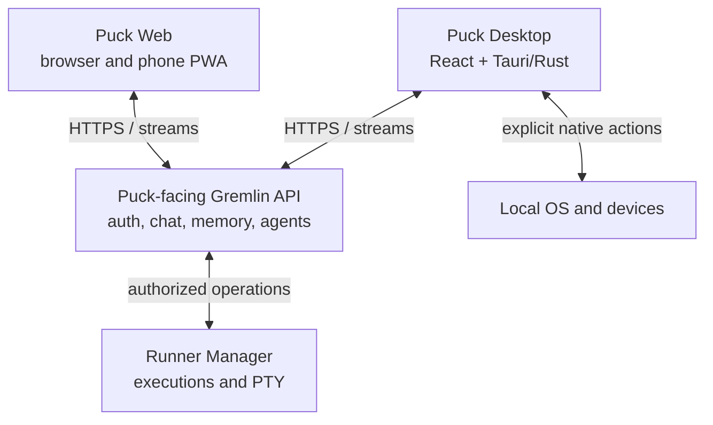

# Puck application architecture

**Status:** Initial proposal  
**Version:** 0.3 · 23 September 2026  
**Owner:** Darkmode Brewing / Gremlin  
**Scope:** Puck desktop and phone clients, shared application libraries, and integration boundaries

## 1. Purpose

Puck is the human-facing client for Gremlin. It lets Lars converse with Gremlin, inspect memories, start and supervise remote agents, attach to their terminals, and grant specific access to devices on the computer in use. Puck is a family of clients connected to the same account and executions. Its browser/PWA build is also Gremlin's web chat; there is no permanent second web chat to maintain.

The first target is a desktop client that feels native and supports chat, an attached terminal, screenshots, microphone input, sound playback, and eventually USB MIDI. The web build runs in desktop browsers and as a phone PWA, with layouts suited to each screen. It shares the React application and protocol logic with the packaged desktop client while supplying browser-safe capabilities.

**Guiding model:** Prime remembers; Runner executes; Puck interacts.

## 2. Decisions and boundaries

| Concern | Initial decision | Owner |
| --- | --- | --- |
| Desktop shell | Tauri 2 with React and TypeScript UI, Rust native host | Puck desktop |
| Web shell | Responsive React/TypeScript PWA: Gremlin web chat in browsers and an installable phone client | Puck web |
| Phone native app | Defer until a proven phone requirement warrants it | Future Puck client |
| Shared code | Pure TypeScript domain, clients, validation, state transitions, and capability contracts | Puck packages |
| Shared visual components | Share React chat and other fitting views; adapt navigation and terminal controls per viewport | Puck UI |
| Browser-facing API | Only Puck operations through a guarded Gremlin gateway; internal services remain private | Gremlin API |
| Chat and memory | Server APIs and streams; Puck holds disposable local presentation state | Gremlin services |
| Agent execution | Remote, durable logical execution; no agent container managed by Puck | Runner Manager |
| Terminal | UI attaches to Runner-managed PTY over an authenticated stream | Runner Manager / Puck |
| Workstation devices | Explicitly requested, narrowly scoped native operations | Puck on that device |

The web client starts as a secure, responsive web app available behind Cloudflare and installable on the iPhone Home Screen. It needs no App Store release, device provisioning, or paid Apple Developer membership. If phone-specific native access becomes essential, assess React Native/Expo and Tauri mobile at that point. The shared packages must not depend on any shell.

## 3. System context



Prime owns history, consolidated memories, provenance, and principal or namespace access. Chat handles conversation and model interaction. Runner Manager owns agent execution specifications, containers, PTYs, isolation, temporary credentials, and cleanup. Puck owns interaction, local device adapters, local permissions, and connection lifecycle. Prime may help compose or validate an execution request; Runner Manager alone controls infrastructure.

The diagram shows logical connections. Deploy the web app and its Puck-facing API behind Cloudflare. Browser terminal streams must pass through an authorized gateway or equivalent attachment endpoint; the browser must not reach Runner Manager's management surface. A desktop attachment may use the same gateway. Short-lived, execution-scoped attach credentials are still useful behind that boundary.

### Public web boundary

The web bundle is delivered to the browser and can be inspected by anyone who can load it. Do not ship service credentials, internal URLs, authorization rules, or secrets in the bundle. Hiding a screen or button does not restrict its backing API. The Puck-facing API authorizes each chat, memory, execution, attachment, and terminal operation for the authenticated principal and namespace, independently of UI state.

Cloudflare is the edge and can optionally apply Access as another identity gate. Gremlin remains responsible for its own application identity, principal/namespace checks, and per-execution authorization. If Access is used, ensure the origin cannot be reached around it, or validate the Access assertion at the origin. Restrict the exposed routes to the client operations needed; keep Prime internals, Runner container administration, and service-to-service credentials on private networks.

Use secure, HttpOnly session cookies where practical, protect state-changing requests against CSRF, and check the Origin and authorization of WebSocket upgrades. Do not cache private conversations or terminal output in the service worker by default. Apply a restrictive content security policy and avoid rendering untrusted HTML from chat or terminal output.

## 4. Repository layout

The tree below is the target layout. The initial scaffold includes only the shared domain, capability contracts, UI, and two application entry points; API clients and richer state packages arrive with the corresponding vertical slices.

```text
puck/
  apps/
    desktop/                Tauri host and packaged React entry point
    web/                    Responsive PWA: desktop browser and phone
  packages/
    domain/                 Types, schemas, state transitions
    gremlin-client/         Chat, memory, identity protocol
    runner-client/          Execution and terminal protocol
    capabilities/           Contracts and permission requests
    app-state/              Shared use cases and view models
    ui/                     Shared React views, tokens, and assets
  crates/
    puck-native/            Rust modules used by desktop host
  docs/
    architecture/           Protocols, decisions, threat model
```

Package boundaries matter more than the exact folder names. `domain`, network clients, and `capabilities` cannot import Tauri, browser globals, Node APIs, or platform UI components. Both applications compose the same React features with different capability adapters; share chat and other fitting views, while tailoring navigation and terminal controls to screen size. The desktop build packages its own local UI assets. It must not load the remotely served PWA into a webview with native command privileges.

Keep protocol schemas versioned in one place, with generated or validated wire types where appropriate. A client should tolerate an unknown event type and show a useful upgrade message for a known event with an incompatible version.

## 5. Application core and capability contract

The shared core coordinates use cases such as sending a chat message, selecting an execution, resuming a terminal, or requesting a local capture. UI components call use cases, not native commands. Native adapters implement a small explicit contract:

```ts
interface PuckCapabilities {
  screen: ScreenCapability;
  audio: AudioCapability;
  midi: MidiCapability;
  notifications: NotificationCapability;
  secureStorage: SecureStorageCapability;
}

type CapabilityAvailability =
  | { available: true }
  | { available: false; reason: string };

interface MidiCapability {
  availability(): Promise<CapabilityAvailability>;
  listOutputs(): Promise<readonly MidiOutput[]>;
  send(message: MidiMessage, destinationId: string): Promise<void>;
}
```

Capabilities describe **what the current client can do**; server authorization and operating-system permission remain separate checks. Browser adapters report unavailable features where appropriate. Do not silently proxy a browser request to a desktop device: that would be an explicit future remote-device feature with its own trust and consent model.

On desktop, the adapter calls Tauri commands; Rust validates parameters and performs OS operations. In the web build, the adapter uses available browser APIs behind explicit user interaction and reports unsupported operations honestly. If a native phone client is later justified, its adapter can implement the same contract. A capability call has structured input, a bounded scope, a clear result or error, and cancellation for long operations. Avoid a generic `executeShell(command)` or unrestricted filesystem command.

## 6. Desktop client

### Screens and interaction

Initial navigation: Chat, Agents, Memory. An agent detail view shows execution state, task metadata, recent events, and an attachable terminal rendered with xterm.js. Device controls can enter later as specific workflows, starting with screenshot capture and voice input. The terminal is a view onto an execution; closing its pane does not stop the execution.

### Native host

Organize Rust commands by capability: screen, audio input, audio output, MIDI, storage, notifications, and OS integration. Request OS permissions at the moment a feature is used, explain what will be captured or sent, and surface denial states. Screen or window capture and microphone recording should show an obvious active state, allow stopping, and create an inspectable attachment before upload. MIDI commands identify the selected output and validate message type and range; do not equate device discovery with permission to transmit.

Use the OS credential store for refresh material or device secrets, never a plain application settings file. Keep sensitive bytes out of terminal logs, application logs, crash reports, and screenshots where possible.

Tauri capabilities restrict which frontend contexts can call commands. The Rust command still enforces its own scope and validation. Ship the desktop UI as bundled local assets; never render the Cloudflare-hosted PWA or arbitrary remote HTML in a privileged webview. Apply a restrictive content security policy and audit deep links and external URL opening.

## 7. Web client and phone PWA

The web build is Gremlin's browser chat on computers and Puck's installable client on phones. It exposes the same authenticated conversations and executions as desktop Puck. Migrate the existing Gremlin Chat into these shared views and routes in increments; keep the old chat accessible during migration if needed, then retire its duplicate frontend once Puck covers its workflows.

Phone priorities: chat, execution creation and status, action approval, and a compact terminal view. Add camera/photo attachment, microphone input, audio playback, and notifications after verifying their behavior on the target iPhone and its Home Screen install. A phone terminal may prioritize observing output and answering prompts over full keyboard-driven shell use. Desktop and phone can consume the same stream protocol while using different components and controls.

Serve the PWA over HTTPS, with a web manifest, icons, and an installable Home Screen presentation. Use appropriate browser session security: prefer server-managed, secure, HttpOnly cookies; avoid persistent bearer tokens in `localStorage`. Confirm authentication and reconnection behavior in standalone mode on iPhone. Keep offline caches small and deliberate; cached execution data must be marked stale.

Home Screen web apps on iOS can request Web Push permission after a user action. Build notifications as a progressive enhancement, with in-app status as the baseline. Camera and microphone access depend on browser permissions and HTTPS; test capture and upload in the actual installed PWA. Browser capabilities vary by platform and version, so device access should be feature-detected rather than promised by the capability interface.

Phone USB MIDI, arbitrary screen/window capture, and deep OS integration are outside the PWA baseline. If a specific phone workflow requires them and browser support is inadequate, evaluate a native client with a focused proof of concept. Installing a durable private iPhone app via Expo internal distribution would require Apple Developer membership and device provisioning; free personal-team signing expires after seven days. This ongoing cost is the reason to defer native distribution, not a reason to weaken the desktop client.

## 8. Remote execution and terminal protocol

Puck creates an execution from a validated specification: repository and ref, task, selected agent runtime/model, curated environment image, tools, and allowed capabilities. The server responds with a stable execution ID. Execution state (`ACTIVE`, `WAITING`, `REVIEW`, `COMPLETED`, `FAILED`, `CLOSED`) is distinct from container state and client connection state. Inactivity or a disconnected client never implies completion.

Runner Manager provides authenticated attach, input, output, resize, detach, and explicit close operations behind the Puck-facing boundary. Specify an attach token scoped to one execution and a short lifetime; server authorization remains authoritative. Support reconnect by fetching an execution snapshot and a bounded output replay from a cursor, then subscribing to live output. State events require sequence numbers or another gap-detection mechanism. Define behavior when history has been pruned so the UI marks the missing segment rather than pretending the stream is complete.

Multiple clients can observe one execution. Define an explicit input-ownership policy before permitting simultaneous writers; the simplest first rule is one active writer, many observers, with a visible takeover operation. Terminal input is never replayed automatically after reconnect, since a resend could run a command twice. Window resize should be idempotent and tied to the current writer or a designated controlling view.

Runner Manager retains the actual PTY and execution lifecycle. Puck may reconnect after hours or days if the execution remains available. Closing a Puck window, losing the network, or switching from phone to desktop only detaches that client. Explicitly closing the execution triggers Runner cleanup under its own lifecycle policy. Durable code work must be committed and pushed before disposal when the task requires it.

## 9. Chat, media, and local action requests

Chat sends messages and attachments through Gremlin APIs and receives streamed responses. Capture flows should distinguish **capture locally**, **review locally**, and **upload/send**. For voice, decide whether transcription occurs locally or on the server per feature; show the destination before sending audio. Playback consumes downloaded or streamed audio without granting the server arbitrary access to the output device.

A server-suggested local action is data, not an executable command. Example envelope:

```json
{
  "id": "action-123",
  "kind": "midi.send",
  "origin": { "conversationId": "chat-456" },
  "parameters": { "destinationId": "device-789", "type": "cc", "channel": 1, "controller": 74, "value": 83 },
  "expiresAt": "2026-09-23T18:00:00Z"
}
```

Puck validates the envelope, shows the exact device and action, obtains a per-action approval or a narrowly scoped saved rule, and records the outcome. The server cannot directly call the Rust host. A saved rule must identify the action type, origin, and device/scope, and be revocable. Require fresh approval for unusually broad or sensitive actions; define these rules with real workflows rather than a universal “always allow” switch.

## 10. Security and failure behavior

| Boundary | Required behavior |
| --- | --- |
| UI → native host | Allowlisted commands, parameter validation, minimal Tauri permissions |
| Browser → Puck-facing API | Authenticated TLS, server-side principal/namespace authorization on every operation, CSRF protection |
| Cloudflare → origin | No bypass path; Access assertion validation if Access is used and the origin remains reachable |
| Puck → terminal stream | Authorized WebSocket upgrade and Origin check; short-lived attach authority, execution-level authorization, input ownership |
| Gremlin → local device | Request shown to user, scoped permission, no silent action |
| Media → Gremlin | User review and explicit send, size/type limits, clear retention rules |

Every network operation has timeout, cancellation, and actionable error states. Offline clients show cached metadata as stale, queue no dangerous local actions by default, and do not claim an execution stopped merely because its stream dropped. Refresh authentication without losing the current draft or terminal selection. Never log tokens, raw microphone recordings, unredacted screenshots, or terminal input.

Threat-model prompts for implementation: compromised chat content trying to induce a local action; malicious terminal escape sequences or links; stolen attach token; a second client taking terminal input; disconnected upload after capture; and device IDs changing across reconnects.

## 11. Delivery slices and acceptance

| Slice | Deliverable | Acceptance evidence |
| --- | --- | --- |
| 0. Contracts | Workspace, domain schemas, typed clients, adapter interfaces | Desktop and web apps consume the same test fixture and compile against the contracts |
| 1. Shared chat | Sign-in, chat list, streamed conversation, reconnect, logout in web and desktop | Existing Gremlin conversation works through both Puck builds; restart restores session safely |
| 2. Agents | Execution list/detail, start request, state changes, attachable terminal | Desktop can detach/reconnect; execution survives client exit; phone can observe later |
| 3. Desktop media | Screenshot and microphone capture, preview, send; sound playback | OS denial is handled; nothing uploads before user sends it |
| 4. Phone PWA | Home Screen install, chat, executions, approvals, compact terminal | Same identity and execution visible across desktop browser, desktop app, and installed iPhone PWA; closing any client leaves execution running |
| 5. MIDI | Discover outputs, select destination, send scoped events | Explicitly approved CC/note reaches the selected device; denial sends nothing |

Start with a narrow vertical path: web and desktop login → shared chat → list an existing execution → attach and reconnect. Validate the same principal and execution through the Cloudflare-served web build and the packaged desktop build before broad device work.

## 12. Open decisions

1. Define the Puck-facing API routes, authentication flow, Cloudflare edge policy, origin protection, and short-lived terminal attach credentials.
2. Map existing Gremlin Chat routes and UI to shared Puck views; decide whether a thin gateway is enough or a Puck-facing aggregation layer is needed.
3. Choose terminal replay storage and retention, output cursor semantics, and single-writer takeover rules.
4. Choose desktop OS targets and packaging/update strategy; test native capture, audio, and MIDI on each target.
5. Test Home Screen authentication, reconnection, terminal input, media capture, and Web Push on Lars's iPhone; document any feature that truly requires a native phone shell.
6. Specify attachment retention, transcription location, and local permission persistence.
7. Define the first actual MIDI workflow with KRETS before broadening the native API.
8. Decide when to retire the existing Gremlin Chat frontend after Puck web reaches feature parity.

## References

- [Tauri runtime authority and capabilities](https://v2.tauri.app/security/runtime-authority/)
- [Tauri configuration and capabilities](https://v2.tauri.app/reference/config/)
- [WebKit: Home Screen web apps and Web Push](https://webkit.org/blog/13878/web-push-for-web-apps-on-ios-and-ipados/)
- [MDN: camera and microphone capture](https://developer.mozilla.org/en-US/docs/Web/API/MediaDevices/getUserMedia)
- [Expo: iOS internal distribution](https://docs.expo.dev/build/internal-distribution/)
- [Apple: free personal-team signing limits](https://developer.apple.com/support/compare-memberships/)
- [xterm.js terminal API](https://xtermjs.org/docs/api/terminal/classes/terminal/)
- [xterm.js WebSocket security guidance](https://xtermjs.org/docs/guides/security/)
- [Cloudflare Access applications](https://developers.cloudflare.com/cloudflare-one/access-controls/applications/http-apps/)
- [Cloudflare: protect the origin and validate Access tokens](https://developers.cloudflare.com/cloudflare-one/access-controls/applications/http-apps/authorization-cookie/application-token/)
- [Cloudflare WebSockets](https://developers.cloudflare.com/network/websockets/)
- [OWASP: enforce authorization on the server](https://cornucopia.owasp.org/cards/FREK)
